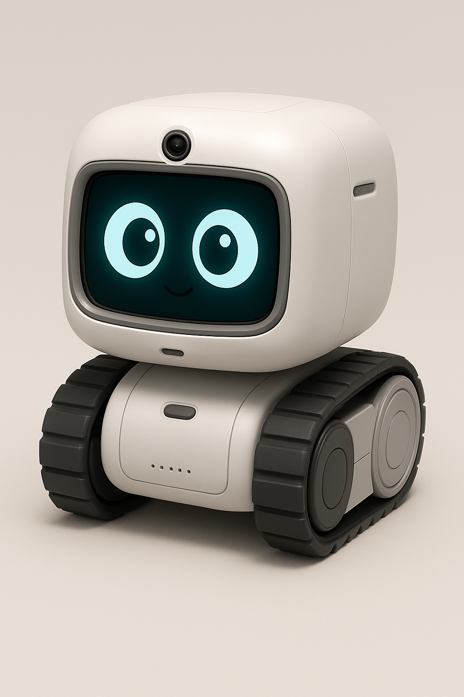
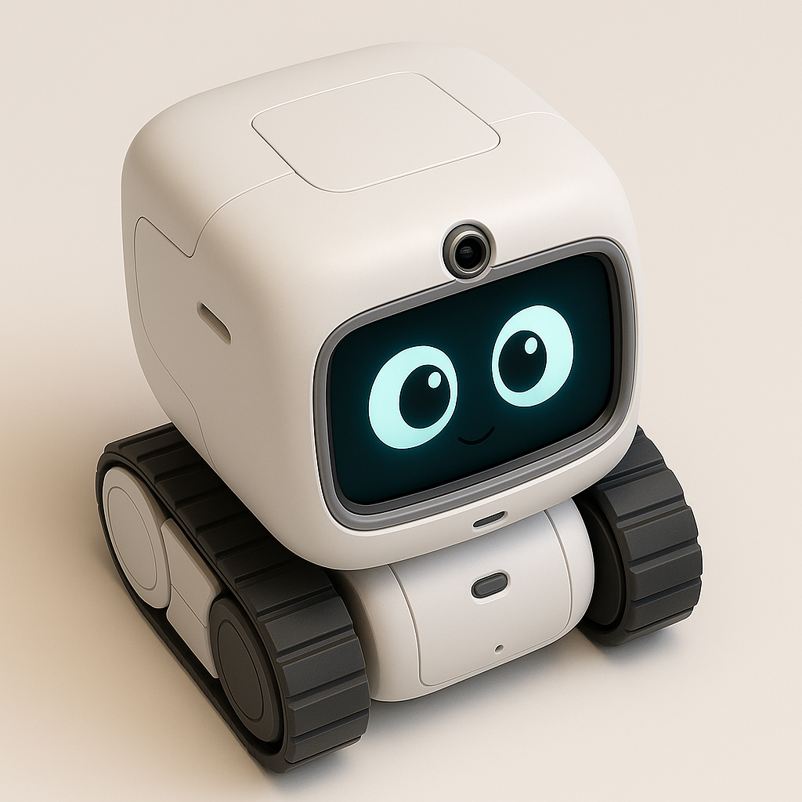
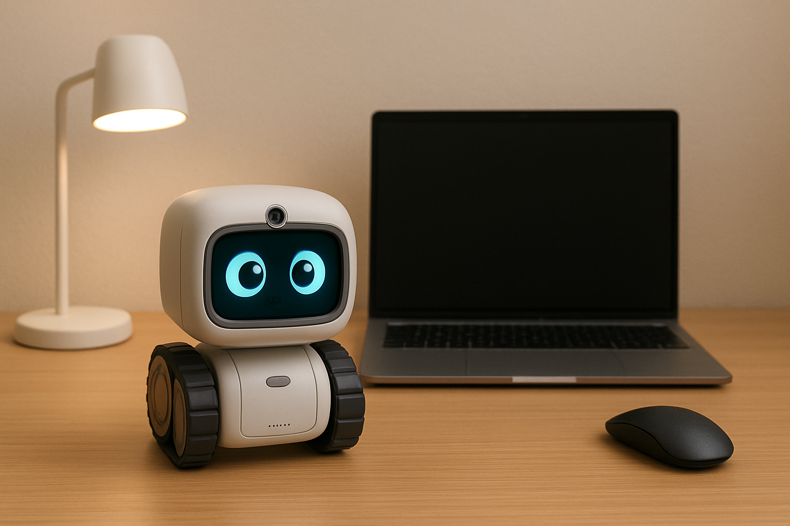

# Mira Bot – Your Desk Companion 🤖✨

Mira Bot is an interactive robot companion designed for people who spend long hours at their desks—programmers, students, or anyone immersed in work. This **app lets you interact directly with Mira Bot**, making your workspace lively, fun, and productive.



---

## What You Can Do With This App

### 🤖 Robot Interaction
- **Face Tracking:** Powered by **[MediaPipe](https://developers.google.com/mediapipe)**, Mira Bot follows your face around the desk in real-time for natural interaction.  
- **Sound Localization:** Detects and reacts to sounds around you using multiple microphones.  
- **Voice Command & Audio I/O:** Give Mira Bot commands, ask questions, or let it respond with sounds.  
- **Notifications:** Receive reminders and alerts directly from the robot.

### 🏃 Movement & Exploration
- Control Mira Bot’s movements in predefined desk spaces.  
- Watch it explore, react to stimuli, and bring life to your workspace.  

### ⏱ Productivity Features
- **Pomodoro Timer:** Stay focused while Mira Bot keeps track of your sessions.  
- **Reminders & Alerts:** Set quick reminders for tasks.  
- **Desk Companion Activities:** Mini-games, jokes, motivational messages, and more.

### 🎨 Cute & Engaging
- Expressive movements, playful sounds, and charming personality.  
- Designed to make your desk experience fun and interactive.

  
*Watch Mira Bot track your face in real-time.*

  
*Move Mira Bot around your workspace while staying productive.*

---

## Technology Stack

- **React Native (Managed Workflow):** Mobile app runs in React Native without ejecting.  
- **[MediaPipe Face Tracking](https://developers.google.com/mediapipe):** Real-time face detection and tracking to animate Mira Bot.  
- **React Native Reanimated / Gesture Handler:** Smooth animations and interactions.  
- **Socket/LAN Communication:** Sends frames from Mira Bot to the mobile device and receives face positions.  
- **Audio & Notifications:** Uses native modules for microphone, speaker, and notifications.  

---

## Installation (Managed Workflow)

> **Note:** This is a React Native **managed workflow app**, Expo CLI is **not required**.

```bash
# Clone the repo
git clone https://github.com/quecci12/mira-bot.git

# Navigate to the project
cd mira-bot

# Install dependencies
npm install
# or
yarn install

# Start Metro bundler
npx react-native start

# Run on Android
npx react-native run-android

# Run on iOS
npx react-native run-ios
